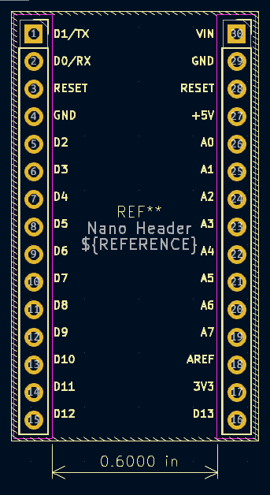
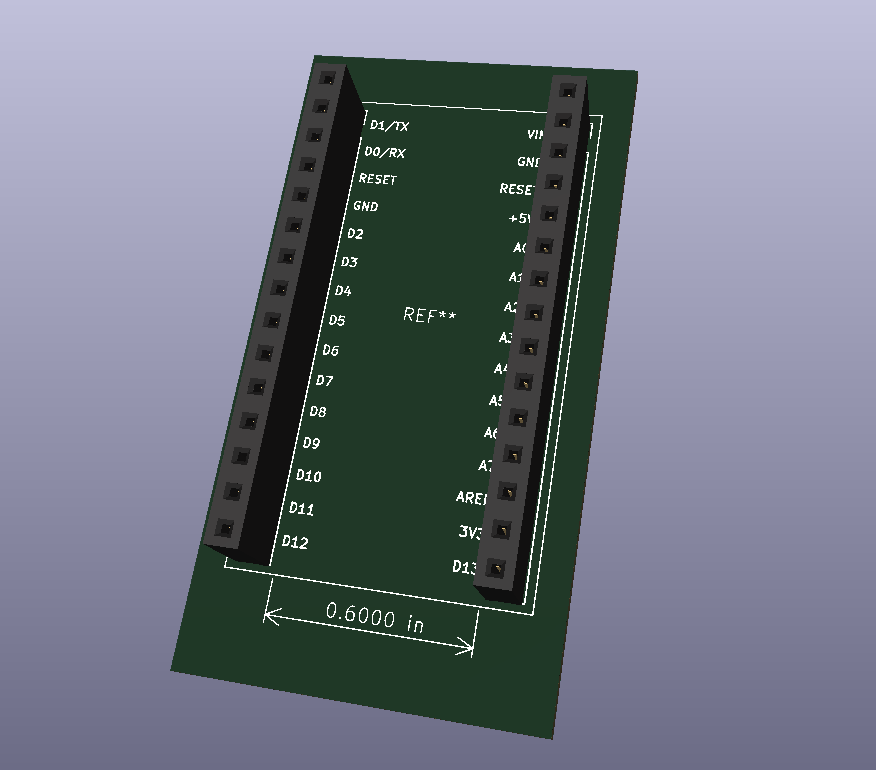

# Arduino Nano Pin Socket Header (V1)

A custom dual-row **female socket header footprint** designed for Arduino Nano boards (30 pins, 2.54 mm pitch, 0.600 in spacing).  
This footprint enables **plug-in modular prototyping** — the Nano can be easily inserted or removed, making it simple to replace or upgrade components without re-soldering.

---

### 🧩 Purpose

Designed for projects that use the Arduino Nano as a removable control module.  
By using dual socket headers, you can:
- Prototype quickly with reusable boards  
- Replace defective or burned microcontrollers easily  
- Swap different Nano variants during testing  
- Maintain cleaner and serviceable PCB layouts

---

### ⚙️ Technical Specifications

| Parameter | Value |
|------------|--------|
| **Pitch** | 2.54 mm (0.1 in) |
| **Rows** | 2 |
| **Pins per row** | 15 |
| **Row spacing** | 0.600 in |
| **Type** | Female pin socket, through-hole |
| **Version** | V1 |
| **Designed in** | KiCad 8 |

---

### 🖼️ Visuals

#### 📘 Footprint Preview

#### 🧱 3D Model

---

### 🧠 Notes

- All pin labels follow the Arduino Nano reference layout.  
- Verified for proper 3D model alignment and solder-pad clearance.  
- Ideal for **plug-and-play control systems** or educational prototyping boards.

---

🪪 **Author:** Pavan Kannan
📅 **Version 1 — November 2025**  
🔧 **License:** MIT (open for educational and personal use)
