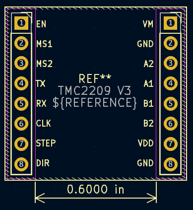
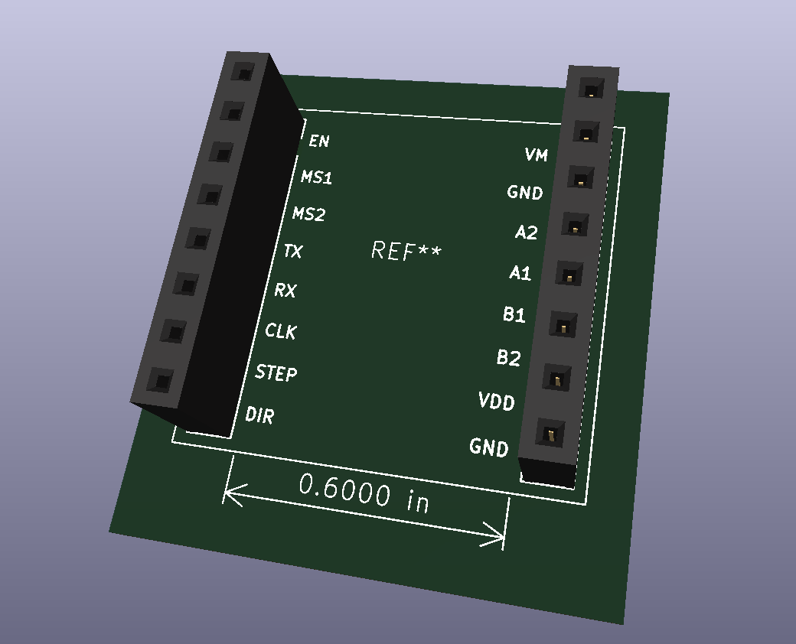

# TMC2209 V3 Pin Socket Header (V1)

A custom **dual-row female header footprint** built for the **TMC2209 V3 stepper driver module** (2.54 mm pitch, 0.600 in spacing).  
It allows the driver to be **plugged in and out easily** — ideal for testing, replacement, or multi-axis motion-control setups.

---

### 🧩 Purpose

This footprint is designed for motion-control projects where stepper-motor drivers need to be modular and replaceable.  
The socket configuration lets you:
- Prototype new driver circuits quickly  
- Replace burned or defective drivers without re-soldering  
- Hot-swap between different Trinamic modules during tuning  
- Maintain a clean and serviceable wiring layout  

---

### ⚙️ Technical Specifications

| Parameter | Value |
|------------|--------|
| **Pitch** | 2.54 mm (0.1 in) |
| **Rows** | 2 |
| **Pins per row** | 8 |
| **Row spacing** | 0.600 in |
| **Type** | Female pin socket, through-hole |
| **Compatible with** | TMC2209 V3 / TMC2208 modules |
| **Version** | V1 |
| **Designed in** | KiCad 8 |

---

### 🖼️ Visuals

#### 📘 Footprint Preview

#### 🧱 3D Model

---

### 🧠 Notes

- Verified spacing for VM, VDD, and signal separation.  
- Compatible with standard BigTreeTech TMC2209 module dimensions.  
- Ideal for **motion-control backplanes, CNC, or robotics projects** where modularity matters.  

---

🪪 **Author:** Pavan Kannan  
📅 **Version 1 — November 2025**  
🔧 **License:** MIT (open for educational and personal use)
